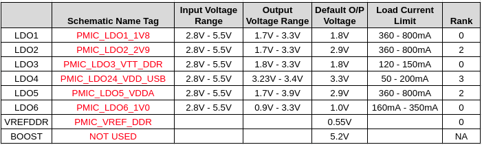
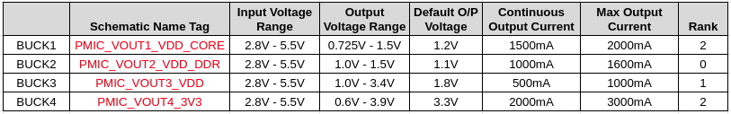

## Hardware Development

### Introduction

Minimum hardware resources and recommendations provided by ST on how to use STM32MP151, STM32MP153 and STM32MP157 lines of MPUs. Refer Application note [Getting started with STM32MP15x Hardware Development AN5031](https://www.st.com/resource/en/application_note/dm00389996-getting-started-with-stm32mp151-stm32mp153-and-stm32mp157-line-hardware-development-stmicroelectronics.pdf) for more detailed information.

### Package Selection

A package is selected by taking into account the following constraints:

- Amount of interfaces required as some interfaces might not be available on some packages and some interfaces combinations might not be possible on some packages.
- PCB available area and PCB technology constraints. Small pitch and high ball density could require more PCB layers and higher PCB class requiring stackup with micro-via (laser via) technology.
- Package size and ball pitch.
- Cost of the MPU.

**Manufacturer Part Number** - STM32MP157CAC3 / STM32MP151CAC3  
**Package** -  TFBGA361  
**Package Size** - 12mm x 12mm.  
**Minimum Pitch** - 0.5mm (Center 0.65)  
**Thickness** - < 1.2mm.  
**Ball Count** - 361  

### Power Supplies

#### General

The system is supplied with 12V DC power supply through a barrel jack connector present on the IO board. This 12V is step down to 5V using a buck converter on the I/O board.  

**Schematic Name Tag for 5V supply** - `5V_VIN`  

The whole system's power is managed by ST's Power management IC present on the snap board.

#### ST PMIC Specifications

**Manfacturer Part Number** - STPMIC1BPQR  
**Package** - WFQFN 44L  
**Package Dimesion** - 5mm x 6mm x 0.8mm  

**Electrical Specifications**

PMIC Input Voltage Range (VIN) - 2.8V - 5.5V  

**VIN** = `5V_VIN`

#### PMIC LDOs

#### PMIC Buck Converters

The start-up sequence is split into four steps (Rank0 to Rank3). Each BUCK converter or LDO regulator can be programmed to be automatically turned ON in one of these phases:

- **Rank= 0:** Rail not turned ON automatically, no output voltage appears after POWER-UP.

- **Rank= 1:** Rail automatically turned ON after 7 ms following a Turn_ON condition

- **Rank= 2:** Rail automatically turned ON after further 3 ms

- **Rank= 3:** Rail automatically turned ON after further 3 ms  

Whatever the STPMIC1 version:

- AUTO_TURN_ON option is set
- Boost and switches cannot be turned ON automatically

**BUCK1_IN** = `5V_VIN`  
**BUCK2_IN** = `5V_VIN`  
**BUCK3_IN** = `5V_VIN`  
**BUCK4_IN** = `5V_VIN`  

**LDO16_IN** = `PMIC_VOUT4_3V3`  
**LDO25_IN** = `5V_VIN`  
**LDO3_IN**  = `PMIC_VOUT2_VDD_DDR`  

