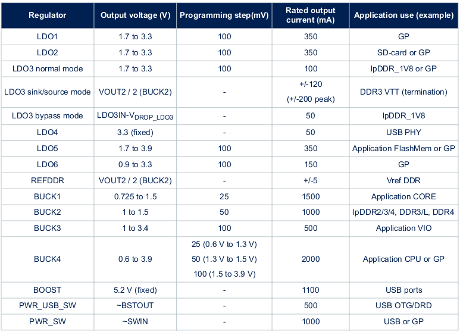
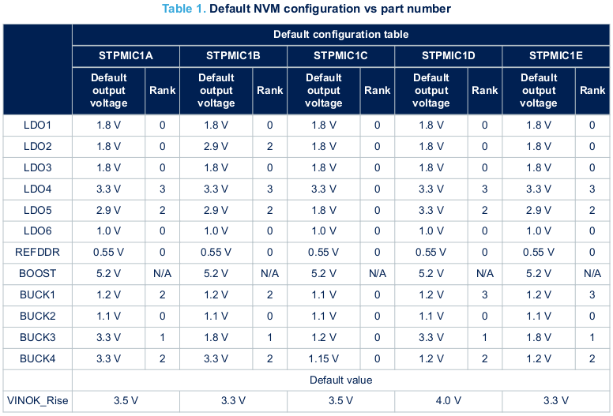
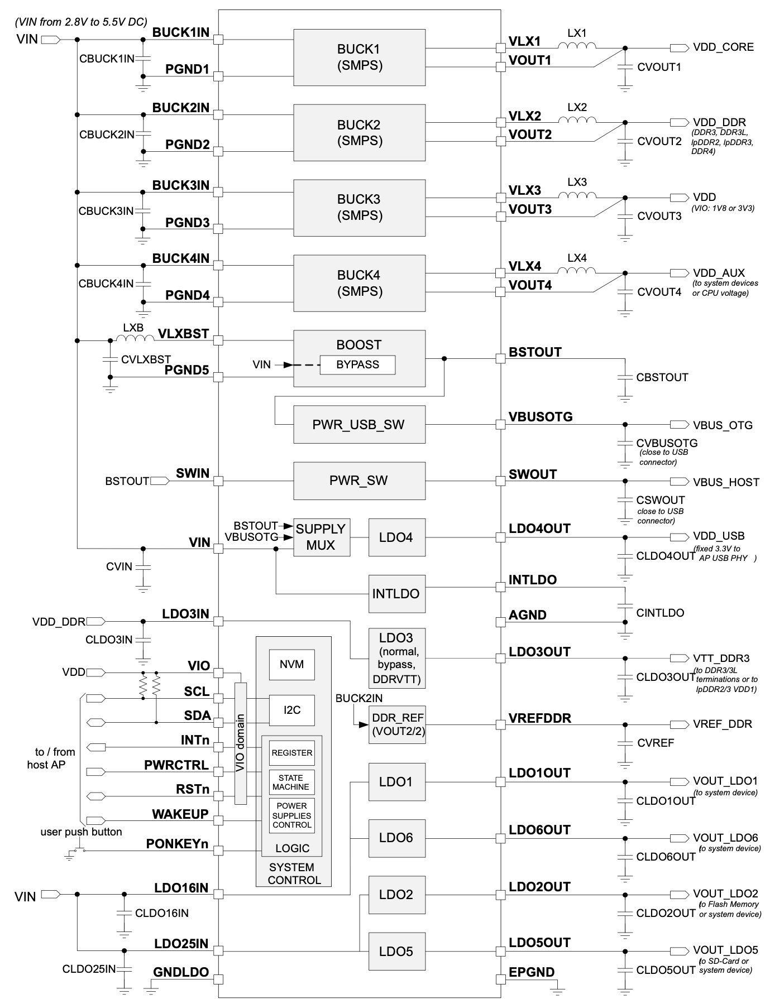
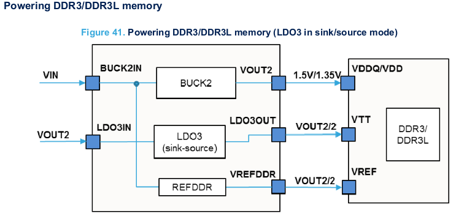

## Hardware Development

### Introduction

Minimum hardware resources and recommendations provided by ST on how to use STM32MP151, STM32MP153 and STM32MP157 lines of MPUs. Refer Application note [Getting started with STM32MP15x Hardware Development AN5031](https://www.st.com/resource/en/application_note/dm00389996-getting-started-with-stm32mp151-stm32mp153-and-stm32mp157-line-hardware-development-stmicroelectronics.pdf) for more detailed information.

### Package Selection

A package is selected by taking into account the following constraints:

- Amount of interfaces required as some interfaces might not be available on some packages and some interfaces combinations might not be possible on some packages.
- PCB available area and PCB technology constraints. Small pitch and high ball density could require more PCB layers and higher PCB class requiring stackup with micro-via (laser via) technology.
- Package size and ball pitch.
- Cost of the MPU.

**Manufacturer Part Number** - STM32MP157CAC3 / STM32MP151CAC3  
**Package** -  TFBGA361  
**Package Size** - 12mm x 12mm.  
**Minimum Pitch** - 0.5mm (Center 0.65)  
**Thickness** - < 1.2mm.  
**Ball Count** - 361  

### Power Supplies

#### General

The system is supplied with 12V DC power supply through a barrel jack connector present on the IO board. This 12V is step down to 5V using a buck converter on the I/O board and is supplied to the PMIC.  

**Schematic Name Tag for 5V supply** - `5V_VIN`  

#### ST PMIC Overview

**Manfacturer Part Number** - STPMIC1BPQR  
**Package** - WFQFN 44L  
**Package Dimesion** - 5mm x 6mm x 0.8mm  

!!! note
    The STPMIC1A and STPMIC1B are pre-programmed devices to support the STM32MP1 series application processor versions. 

The STPMIC1 provides all regulators needed to power supply a complete application. This IC is preset on Snap board. It has:

- 6 LDOs + 1 reference voltage LDO for DDR Memories. 
- 4 Step down (buck) converter. 
- 1 step-up(boost) converter with a bypass to supply USB sub-system.
- 2 power switches to supply USB sub-system. 

**LDO1, LDO2, LDO5, LDO6** are general purpose (GP) LDO (low-dropout) linear regulators and can be used to supply application peripherals.  

**LDO3** is a multipurpose linear regulator that supports 3 modes:

- **Normal mode**: operates as standard LDO with 1.7 to 3.3 V output voltage range (for general purpose use)
- **Sink/source mode**: LDO3 operates in sink/source regulation mode to supply termination resistors of DDR3/DDR3L memory interface (VTT voltage).
- **Bypass mode**: LDO3 operates as a simple power switch to supply lpDDR2/3 VDD1 (1.8 V) power domain. In that case, LDO3IN is supplied by 1.8 V. This is a preferred mode versus normal mode in term of power efficiency to power supply lpDDR2/3 VDD1.

!!! note
    In this application LDO3 is used as Sink/Source mode.

**LDO4** is a fixed output voltage (3.3 V) LDO and it is dedicated to power supply host processor USB PHY.  

**DDR REF** is sink/source reference voltage LDO dedicated to power VREF of lpDDR/DDR. 

**BOOST** is a fixed output voltage 5.2 V synchronous step-up converter dedicated to power supply USB ports (PWR_USB_SW and/or PWR_SW power switches).

#### LDO Typical Schematic

#### Powering DDR3 Memory with STPMIC

In this project, DDR3L memory is used. 

LDO3IN is a power supply from BUCK2 output (VOUT2) and LDO3 output regulate at Vout2/2 voltage.

